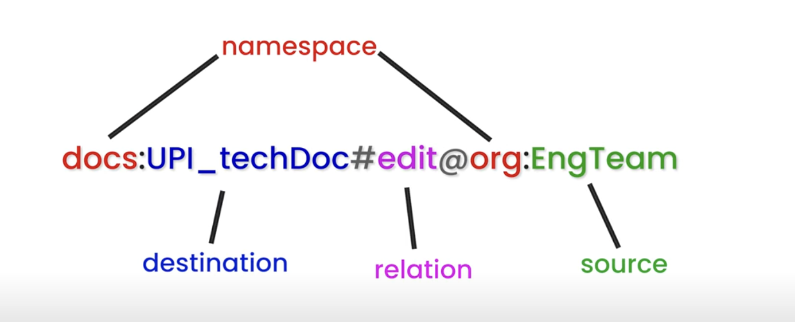

### Rewrite significance

#### Setup

Relations
```
document.owner
document.viewer
group.member
```

#### Rewrite type: THIS

Definition
```
document.owner = this
```
If a tuple exists directly on that relation, grant access.

Examples
```
document:doc1#owner@user:alice
document:doc1#owner@user:bob
```

Who are owners?
- alice
- bob

#### Rewrite type: Union

Definition
```
document.viewer = union(this, tupleToUserset("owner", "member"))
```

Meaning
A user is a viewer of they are:
1. Directly assigned via document#viewer@user:x OR
2. Indirectly a member of the document's owner group (tupleToUserset part.)

Examples:
```
document:doc1#viewer@user:carol
document:doc1#owner@group:eng#member
group:eng#member@user:alice
```

Who are the viewers?
- carol (directly accessed via this)
- alice (indirect via group)

#### Rewrite type: TUPLE_TO_USERSET

Definition:
```
Rewrite.tuple_to_superset("owner", "member")
```
Take every principal referenced by document#owner (which might be userset refs like group:eng#member) and evaluate their member relation to see if user is inside.

Example:
```
document:doc1#owner@group:eng#member
group:eng#member@user:alice
```

#### Mixing them - nested rewrites
```
document.viewer = union(
    this,
    tupleToUserset("owner", "member"),
    tupleToUserset("shared_with", "member")
)
```
Explanation:
A user can view if they are a direct viewer OR 
A member of any group listed as an owner OR 
A member of any group listed in shared_with.


### Adhoc Screeenshots

